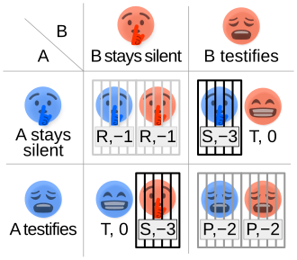

# 🎮 Oyun Teorisi 

## Yazarın Yazma Süreci 
- Yale'nin oyun teorisi videoları takip ettim.Kendi araştırmlarımı da ekleyip çeşitlindirmeyi hedefliyorum.Bu benim finaller sonrası yaz için yapcagım ilk projelerden olcak. 
**18.06.2025**

- Dillemma oyunu için kesinlike testifies şeçenegini şeçerdim .
**29.06.2025**

- Vİdoo serisi hoş ama bir miktar bilgisayar bilimci oldugumu unttum galiba .
**8.07.2025**

## İçindekiler

1. Giriş ve Temel Kavramlar

## 1. 🧩 Giriş ve Temel Kavramlar

## Oyunun Parçaları

oyun teorisi hakkında temel kavramları ögrenmeden önce basit bir oyun inceleyip bu konuda bize verilebilcek örneklere bakalım.

### Prisoner's dilemma

- Oyun teorisin temel oyunlarımdan biri olan hapisteki insanın davranışları üzerinden payoff ve straejiler üzerine temel sonuçları çıkarmamızda bize yardımcı oluyor.siz olsaydınız hangi şeçenegi tercih ederdiniz ?

---

### 💰 Ödül (Payoff)

-  Oyuncunun oyun boyunca elde etmek istegi kar için kullanılan terim.
-  Bu istegin bilinmesi oyun teorisini temel parçalarından biri eger bir oyuncunu payofflarını dogru şekilde analiz edersek onun oyun boyunca kullanıcagı stratejinin ne olfugunu anlamış ve sonraki yapvagı hamleleri analiz edebielcek durumu gelmiş oluruz.
- payofflar çok çeşitli olalablir. mesela yale videosunda bahsettigi oyunda toplulugun faydasını düşünmek veya kendi faydamızı öncelemek gibi iki temel payofftan bahsediliyor bunlar tamamıyla oyuncunun yapacagı şecimi belirliyor.

---

### Stratejiler

Strateji genel olarak ne oldugu bilinen bir kavram burda ilerde işime yarayacak iki tür streji ögrensek yeterli.bunlar :

- **Strictly Dominant Strategy** : Oyuncu, rakiplerinin hangi stratejiyi seçtiğinden bağımsız olarak, bu stratejiyi seçerse daha iyi payoff alır.
- **Strictly Dominated Strategy** Oyuncu, ne olursa olsun başka bir strateji o stratejiden daha iyi payoff sağlar.

bu konuda şunu bilmeyiliyiz oyun teorisi her zaman Strictly Dominated Strategy uzakd durmamız gerektigini söyler.

--- 

### Kordinasyon

- Oyun teorisinde koordinasyon, oyuncuların çıkarlarının uyumlu olduğu, yani birlikte hareket ederek daha iyi sonuç alabilecekleri durumları ifade eder.

- Bu tür oyunlarda temel amaç, birbirlerinin seçimleriyle uyumlu kararlar almaktır.

### Koordinasyon Problemleri (Coordination Problems)

-   Oyunların içne kordinasyon süreçleri dahil oldugu zaman kordinasyon oyuncular ve onların payofflarına göre farklı kordinasyon şeçenekleri ortaya çıkar.
    
-   Bu durum, oyuncuların hangi dengede buluşacaklarını kestirememesine yol açar.bu da esas problemimiz olan birbirleriyle nasıl koordine olacaklar? ve nasıl en pozitif payoff ile sonuça ulaşaakları durmunu ortaya çıkarır 

### 🔑 Önemli Sonuç: Kendimizi Başkalarının Yerine Koymak

Oyun teorisinin ögrenmek için gerekn temel kavramları ögrendik ve teorinin  temel çıkarımlarından biri olan şu yargıya vardık:

> **Kendi stratejimizi belirlemek için başkalarının hangi payoff’lara değer verdiğini ve ne yapacaklarını tahmin etmeliyiz.**

ilerdki section bunu daha ayrıntılı incelyecegiz:

