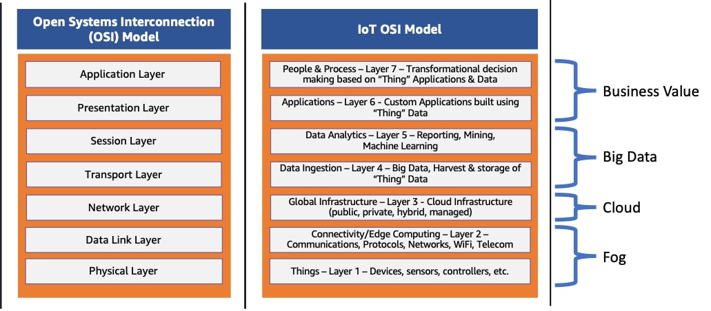

# Ağ Protokolleri (Network Protocols)

## Temel yapı OSI Model 

Uluslararası Standardizasyon Örgütü tarafından oluşturulan Osi modeli iletişimini 7 temel hatta bölerek çeşitli aglarn iletişimi için  belli bir standrat sunan bir kavramdır.Osi modeli bilgisayar agları için uluslararası bir dil olark düşünelebilir.

### Physical Layer (Fiziksel Katman): 

Fiziksel Katman kablosuz veya kablolu bağlantılar (Ethernet kabloları, fiber, Wi-Fi,Nfc, Bloouteth) Kapsar.bitlerin noktalar arası taşınmasından sorumludur.Veri alırken, bu katman alınan sinyali alır, 0 ve 1’lere dönüştürür ve ardından bunları Data Link Layer’a gönderir. Veri Bağlantı Katmanı ise bu bitleri tekrar bir araya getirir.

Fiziksel Katmanın İşlevleri:

- **Bit Senkronizasyonu:** Saat sinyali ile bitleri gönderen ve alan arasında organizasyonu saglar
    
- **Bit Hızı Kontrolü:** Gönderilen bit sayısını ayarlar
    
- **İletim Modu:** Fiziksel katman, verinin iki bağlı cihaz arasında nasıl aktığını da belirler.

### Data Link Layer (Veri Bağlantı Katmanı):

Fiziksel katmanın hali hazırda var oldugu baglantılarda bitlerin transferinin hatasız bie şekilde gerçekleştigini kontrol eden osi tabakasıdır.

Veri Bağlantı Katmanı, MAC adreslerini, çerçeveleme işlemini ve hata kontrolünü gerçekleştirir. Bu sayede ağdaki cihazlar birbirini fiziksel adresleri (MAC adresleri) üzerinden tanır ve veri iletimi sırasında oluşabilecek hatalar tespit edilip düzeltilir.

Bir paket ağa ulaştığında, onu doğru hedefe iletmek Veri Bağlantı Katmanı’nın sorumluluğundadır. Bu işlem, hedef cihazın MAC adresi kullanılarak yapılır. Veri Bağlantı Katmanında işlenen veriye frame denir. Bu katmanda çalışan temel cihazlar switches ve köprüler bridgelerdir.

Üst katmandan (Ağ Katmanı) gelen paketler, network interface kartının anlayavagı boyuta işlenir.Katman, her çerçevenin başlığına gönderici ve alıcının MAC adreslerini ekler. Alıcının MAC adresi, ARP (Address Resolution Protocol) isteğiyle öğrenilir. Bu protokol, “Bu IP adresine kim sahip?” sorusunu yönlendirir ve hedef cihaz kendi MAC adresiyle yanıt verir. 

***1\. Mantıksal Bağlantı Denetimi (LLC – Logical Link Control)***

LLC, Veri Bağlantı Katmanının üst kısmında yer alır ve ağ katmanı ile fiziksel ağ arasındaki iletişimi yönetir.

***2\. Ortam Erişim Denetimi (MAC – Media Access Control)***

MAC alt katmanı, Veri Bağlantı Katmanının alt kısmında yer alır ve verinin fiziksel ortama nasıl gönderileceğini belirler.  
Birden fazla cihazın aynı ağ ortamını paylaştığı durumlarda, hangi cihazın o anda veri gönderebileceğine karar verir.

### Network Layer (Ağ Katmanı):

Network katmanı farklı aglar arasındaki veri transferini kolaylaştırmakla görevli olan osi katmanıdır.Bunu transport layerdeaki segmentleri ayrıştırarak (paketlere) gönderir.bunları alıcı cihazda tekrar birleştirir .Ağ katmanı ayrıca verinin hedefine ulaşması için en iyi fiziksel yolu bulur. buna yönlendirme (routing) denir.Bazı network layer protokelleri : IP(IPv4/IPv6),ICMP,ARP,RARP,NAT,RIP,OSPF,BGP

Ağ Katmanında adresleme, cihazların ağ üzerindeki kimliğini belirler. Her cihazın benzersiz bir IP adresi vardır ve bu adres sayesinde veriler doğru hedefe ulaşır. IP adresleri iki kısımdan oluşur: ağ adresi (network ID) cihazın bulunduğu ağı, cihaz adresi (host ID) ise o ağdaki cihazı belirtir. Örneğin 192.168.1.10/24 ifadesinde 192.168.1 ağ kısmı, .10 ise cihaz kısmıdır.Bunlar rooter ve switvhler tarafından yapılır.

Network Layer İşlevleri:

- Yönlendirme (Routing): Verinin hedefe ulaşması için en uygun yolu belirleme.

- Adresleme (Addressing): Cihazlara mantıksal (IP) adres atama.

- Paketleme (Packetizing): Veriyi ağda taşınabilecek paketlere bölme.

- Trafik Kontrolü (Traffic Control): Ağ üzerindeki veri akışını dengeleme.

- Parçalama ve Birleştirme (Fragmentation & Reassembly): Paketlerin ağın maksimum boyutuna (MTU) uygun hale getirilmesi.

- Hata Raporlama (Error Reporting): ICMP gibi protokollerle iletim hatalarının bildirilmesi.

### Taşıma Katmanı (Transport Layer):
TCP, UDP ile veri aktarımının güvenliği ve sıralanması

### Oturum Katmanı (Session Layer):
İki cihaz arasında oturum açma ve yönetme

### Sunum Katmanı (Presentation Layer):
Veri formatlama, şifreleme, sıkıştırma

### Uygulama Katmanı (Application Layer):
Kullanıcıya yakın protokoller (HTTP, FTP, DNS)        

## Dosya Transferi (File Transfer)
    
### FTP (File Transfer Protocol)
        
### SFTP (SSH File Transfer Protocol)
        
## Web İletişimi (Web Communication)
    
### HTTP (Hypertext Transfer Protocol)
        
### HTTPS (HTTP Secure)
        
## Güvenlik ve Şifreleme (Security and Encryption)**
    
### SSL / TLS (Secure Sockets Layer / Transport Layer Security)
        
### SSH (Secure Shell)
        
## Ad Çözümleme (Name Resolution)
    
### DNS** (Domain Name System)

## Kaynakça

https://aws.amazon.com/tr/what-is/osi-model/
https://tr.wikipedia.org/wiki/OSI_modeli
https://www.geeksforgeeks.org/computer-networks/open-systems-interconnection-model-osi/
https://www.cloudflare.com/learning/ddos/glossary/open-systems-interconnection-model-osi/