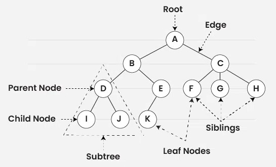

# Agaç Nedir?

Ağaç, düğümlerin kenarlarla birbirine bağlandığı hiyerarşik bir veri yapısıdır. Bir ağaç, tek bir kök düğümden başlar ve her düğüm sıfır ya da daha fazla alt düğüme (çocuğa) sahip olabilir. Böylece, kökten aşağıya doğru dallanan ve ters çevrilmiş bir ağaç yapısını andıran bir hiyerarşi oluşur.Agaçlar circle olmayan graflar olan tek yönlü veri yapıları olrakda nitelendielerbir

### Veri Yapılarında Ağaçların Önemi

Ağaçlar, çok yönlülükleri ve verimlilikleri sayesinde veri yapılarında temel bir rol oynar. Önemli olma nedenlerinden bazıları şunlardır:

- **Verimli Arama ve Erişim:** Ağaçlar, verimli arama algoritmaları sunar ve bu nedenle veritabanları ve arama motorları gibi uygulamalarda kullanılır.

- **Parserler:** 
    
- **Optimize Edilmiş Depolama ve Erişim:** Dosya sistemlerinde ağaçlar, verilerin organize edilmesi ve saklanması için kullanılır; böylece hızlı erişim ve güncelleme imkânı sağlanır.

- **Desicion tree:** Bir karar algoritması olan tervih agaçlarında kullanırlar
    
- **Network Yönlendirme:** Ağaçlar, ağlarda yönlendirme işlemlerinde kullanılır.

### Agaçların Yapısı 

Ağaçlarla ilgili çalışırken kullanılan bazı temel kavramlar şunlardır:

- **Root (Kök):** Ağacın başlangıç düğümü. 
- **Parent (Ebeveyn):** Çocuğu olan düğüm. 
- **Child (Çocuk):** Bir ebeveyne bağlı olan düğüm.  
- **Leaf (Yaprak):** Çocuğu olmayan düğüm.  
- **Depth (Derinlik):** Bir düğümün kökten olan uzaklığı.  
- **Height (Yükseklik):** Ağacın en derin yaprağının köke olan mesafesi. 

## 🌳 Temel Ağaç Türleri  

### Binary Tree
Her düğümün en fazla iki çocuğu olabilir: **sol (left child)** ve **sağ (right child)**.  
Bu yapı, pek çok algoritmanın ve özel ağaç türünün temelini oluşturur.  

### N-ary Tree (Generic Tree)
Her düğüm, kendi çocuklarının adreslerini saklar.  
- Bir düğümün **birden fazla çocuğu** olabilir.  
- Çocuk sayısı **önceden bilinmez**.  
- Dosya sistemleri (klasör → alt klasörler) bu yapıya güzel bir örnektir.  

---

## 🌲 Özel Ağaç Türleri  

Bu ağaçlar, belirli problemleri daha verimli çözmek için tasarlanmış yapılardır.  

### Binary Search Tree (BST)
- Her düğümün **sol alt ağacı** kökten küçük,  
- **sağ alt ağacı** kökten büyük değerler içerir.  
Bu özellik sayesinde arama, ekleme ve silme işlemleri ortalama **O(log n)** zamanda yapılabilir.  
Ancak dengesiz hale gelirse, bağlı listeye benzeyip verimsizleşebilir.  

### Heap
Öncelikli işler (priority queue) için kullanılan özel bir ağaçtır.  
- **Min Heap:** Her düğüm çocuklarından küçük/eşittir. Kök en küçük elemandır.  
- **Max Heap:** Her düğüm çocuklarından büyük/eşittir. Kök en büyük elemandır.  
Genellikle **tam ikili ağaç (complete binary tree)** şeklinde tutulur ve dizi ile uygulanır.  

### Trie (Prefix Tree)
Özellikle **kelime ve string aramalarında** kullanılır.  
- Her kenar bir harfi temsil eder.  
- Bir kökten yaprağa giden yol, bir kelimeyi oluşturur.  
- Örneğin “cat” ve “car” kelimeleri aynı “ca” yolunu paylaşır.  

**Kullanım alanları:**  
- Otomatik tamamlama (Google arama çubuğu gibi)  
- Sözlük uygulamaları  
- IP yönlendirme  

### Suffix Tree
Bir string’in **tüm son eklerini (suffix)** ağaç yapısında saklar.  
- Örneğin `"banana"` kelimesinin suffixleri:  
  `"banana", "anana", "nana", "ana", "na", "a"`  
- Bu suffixler özel bir ağaç yapısında tutulur.  

**Avantajları:**  
- Çok hızlı substring aramaları yapılabilir.  
- Metin işleme, DNA dizilimleri, veri sıkıştırma algoritmalarında kullanılır.

# şimdilik buraya kadar nasıl yazılır çizilir gelcek