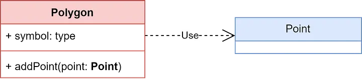

## 1. Temel Giriş bilgileri

### 1.1 Java ve OOP Nedir Bunlar?

İlk olarak nesneye yönelik programlama nedir? Basitçe kod yazarken yaklaşım olarak kodu tekrar kullanılabilir, bir hiyerarşiye sokulabilir halde, parçaçıklar (nesneler) halinde yazılması yaklaşımına verilen addır.
Sürdürülebilirlik ve tekrar kullanılabilirlik açısından çoğu projede sıklıkla karşımıza çıkmaktadır.

Peki Java ne? Java, bu yaklaşımı temele alarak geliştirilmiş popüler bir yazılım dilidir. Çoklu platform desteği ve hızı ile günümüzdeki çoğu uygulamanın altında varlığını sürdürmektedir.

Nesneye yönelik programlamayı icat eden: **Alan Kay**’den

Kaynak:
[https://userpage.fu-berlin.de/\~ram/pub/pub\_jf47ht81Ht/doc\_kay\_oop\_en](https://userpage.fu-berlin.de/~ram/pub/pub_jf47ht81Ht/doc_kay_oop_en)


### 1.2 Java Compile Süreci

Java, bildiğimiz diller gibi doğrudan spesifik olarak cihaza derlenmez. Bunun yerine Java standartlarına göre **bytecode** adı verilen ara koda çevrilir. Bu sayede farklı cihazlar üzerinde Java Virtual Machine (JVM) ortamında çalıştırılabilir.
Java’nın en önemli özelliği **Write Once, Run Anywhere** yaklaşımını gerçekleştirmesidir.
Bu sürece yakından bakalım:

1. **Kaynak Kod (Source Code)**:
   `.java` uzantılı dosyalarda yazılır. Metin tabanlı kullanıcı kodudur.

2. **Derleme (Compile)**:
   Java derleyicisi (**javac**) kaynak kodu alır ve **Java Bytecode** adı verilen ara koda çevirir. Çıkan dosya `.class` uzantılıdır.

   ```bash
   javac [dosyaAdı.java]
   ```

3. **Çalıştırma (Run)**:
   JVM bu bytecode dosyasını çalıştırır. JVM her işletim sisteminde farklıdır. Bu sayede aynı `.class` dosyası işletim sistemi gereklilikleri ile donatılarak bilgisayarda çalıştırılır.

   ```bash
   java [SınıfAdı]
   ```


### 1.3 Java Temel Syntax Yapısı

Dosyalarımızı nasıl compile edeceğimizi öğrendik, peki dosyalarımızın içeriği nasıl? Hadi bakalım:

```java
public class hello { // program adıyla hello kısmı aynı olması gerekiyor
    public static void main(String[] args) {
        // burası programın başlangıç noktası
        System.out.println("Merhaba Dünya!"); // temel printf
    }
}
```

## 2. Class ve Object (Sınıf ve Nesne)

### 2.1 Sınıf Nedir?

Sınıf, nesnelerin nasıl oluşturulacağını tanımlayan bir şablondur veya bir plandır.
Tıpkı bir mimarın ev inşa etmeden önce bir plan çizmesi gibi, yazılımcılar da nesnelerini oluşturmadan önce sınıflarını tanımlar.
Bir sınıf, oluşturulacak nesnelerin hangi **özelliklere (attributes)** sahip olacağını ve hangi **davranışları (methods)** sergileyebileceğini belirler.

* **Özellikler (Attributes)**: Nesnenin sahip olduğu verileri tutar.
* **Metotlar (Methods)**: Nesnenin gerçekleştirebileceği davranışları tanımlar.


### 2.2 Nesne Nedir?

Nesne, bir sınıfın somutlaşmış halidir.
Yani sınıf bir şablon gibi düşünülebilir; nesne ise bu şablonun gerçekleştirilmiş hâlidir.

Örneğin, bir sınıf içinde bir int değişken tanımlarsınız, fakat bu değişkene sınıfın kendisinde doğrudan bir değer atayamazsınız.
Nesneler oluşturulduğunda, şablona göre her biri kendi bağımsız sayı değerine sahip olur.

### 2.3 Sınıf Tanımlama

Yazı boyunca genel olarak Java üzerinden gösterim yapacağız ama UML diyagramları ile ilgili kısımlarda bulunacak, zamanla gerekli eklemeler yazılacak.

Örnek Java kodu:

```java
// Araba sınıfı
public class Araba {

    // Özellikler (Attributes)
    String renk;
    String model;
    int hiz;

    // Metotlar (Methods)

    // Araba'nın hızını artıran metot
    public void hizlan(int artis) {
        hiz = hiz + artis;
        System.out.println("Araba hızlandı. Yeni hız: " + hiz);
    }

    // Araba'nın hızını azaltan metot
    public void frenYap() {
        if (hiz > 0) {
            hiz = 0;
            System.out.println("Araba durdu.");
        } else {
            System.out.println("Araba zaten duruyor.");
        }
    }
}
```
📌 UML gösterimi: 
```uml
classDiagram
    class Araba {
        -String renk
        -String model
        -int hiz
        +hizlan(int artis)
        +frenYap()
        +vitesDegistir(int yeniVites)
    }
```

### 2.4 Nesne Oluşturma (new) ve Nesneye Değer Atama

Programlama dillerinde nesne oluşturmayı, bir `struct` yapısıyla yeni bir veri tanımlamak gibi düşünebiliriz. Bunun için dile göre farklılık göstermekle birlikte, bellekte nesne için gerekli alanın ayrılması ve nesnenin varsayılan değerlerinin atanması gerekir.

Çoğu dilde bu işlem için **new** anahtar kelimesi kullanılır.

`new` anahtar kelimesi bellekte nesneye yer ayırır ve başlangıç değerlerini yükleyerek nesneyi kullanıma hazır hale getirir. Bu sürece **nesne örneği oluşturma (instantiation)** denir.
Nesne oluşturulduktan sonra, özelliklerine nokta (`.`) operatörü kullanılarak erişilebilir ve değerler atanabilir.

Java’da nesne oluşturma örneği:

```java
// Ana sınıf (Main)
public class Main {
    public static void main(String[] args) {

        // 1. Nesne Oluşturma
        // "new Araba()" ifadesi bellekte yeni bir araba nesnesi oluşturur.
        // "benimArabam" bu nesneyi işaret eden bir referanstır.
        Araba benimArabam = new Araba();

        // 2. Nesneye Özellik Atama
        // Nokta operatörü (.) kullanarak nesnenin özelliklerine erişim
        benimArabam.renk = "Kırmızı";
        benimArabam.model = "Sedan";
        benimArabam.hiz = 0;
    }
}
```
📌 UML gösterimi:

```uml
classDiagram
    object benimArabam {
        renk = "Kırmızı"
        model = "Sedan"
        hiz = 0
    }
```


### 2.5 Nesne Üzerinden Metot Çağırma

Tıpkı özelliklere erişim gibi, bir nesnenin metotlarına da nokta (`.`) operatörü kullanılarak erişilir ve metotlar çağrılır. Metot çağrıldığında, o nesneye özgü bir işlem gerçekleştirilir.

```java
benimArabam.hizlan(20); // benimArabam nesnesinin hızını 20 artırır.
```

## 3. Constructor (Yapıcı)

Bir sınıftan nesne oluştururken, özelliklerin başlangıç değerlerini atamak için kullanılan özel metotlara constructor (yapıcı metot) denir.

### 3.1 Default Constructor (Parametresiz)

Eğer sınıfta hiç constructor yazmazsanız, Java otomatik olarak parametresiz (default) bir constructor sağlar.
Bu constructor, nesneyi oluşturur ama değer atamaz.

```java
public class Araba {
    String renk;
    String model;
    int hiz;

    // Parametresiz constructor
    public Araba() {
        System.out.println("Yeni bir araba oluşturuldu!");
    }
}
```

Kullanımı:

```java
Araba a1 = new Araba(); // Parametresiz constructor çağrılır
```

📌 UML Gösterimi:

```uml
classDiagram
    class Araba {
        -String renk
        -String model
        -int hiz
        +Araba()
    }
```

### 3.2 Parametreli Constructor

Parametreli constructor, nesne oluşturulurken özelliklere başlangıç değerleri vermemizi sağlar.this anahtar kelimesi, sınıfın içindeki özellikleri (attributes) ile metot parametrelerini ayırt etmek için kullanılır.

```java
public class Araba {
    String renk;
    String model;
    int hiz;

    // Parametreli constructor
    public Araba(String renk, String model, int hiz) {
        this.renk = renk;// sağdaki model = parametre
        this.model = model;// this.renk = sınıfın özelliği
        this.hiz = hiz;
    }
}
```

Kullanımı:

```java
Araba a2 = new Araba("Mavi", "Hatchback", 10);
```

📌 UML Gösterimi:

```uml
classDiagram
    class Araba {
        -String renk
        -String model
        -int hiz
        +Araba(String renk, String model, int hiz)
    }
```

## 4. Encapsulation (Kapsülleme)

Kapsülleme, nesneye yönelik programlamanın temel prensiplerinden biridir.
Bu ilke, verilerin gerektiğinde erişiminin kısıtlanmasını sağlar. Özellikle nesne özelliklerine (alanlara) doğrudan erişimi engelleyerek verilerin yanlış veya istenmeyen şekillerde değiştirilmesini önlemeyi amaçlar. Böylece kod daha güvenli, sürdürülebilir ve yönetilebilir hâle gelir.

### 4.1 Erişim Belirleyiciler (Access Modifiers)

Erişim belirleyiciler, bir sınıfın, alanın , metodun veya yapıcı metodun access seviyesinin belirleyen anahtar kelmelerdir.

### 4.1.1 public

- En geniş erişim düzeyidir.
    
- public olarak tanımlanan bir öğeye projenin her yerinden erişilebilir. Bu, o sınıfın içinden, aynı paketten, farklı bir paketten ve alt sınıflardan erişim demektir.
    
- Genellikle dışarıya sunulması gereken metotlar veya sabitler static final için kullanılır.

- Uml diyagramlarında + sembolü ile gösterilir

### 4.1.2 private

- En kısıtlı erişim düzeyidir.

- private olarak tanımlanan bir öğeye yalnızca o öğenin tanımlandığı sınıf içinden erişilebilir.

- Başka hiçbir sınıf (aynı pakettekiler veya alt sınıflar dahil) bu öğeye doğrudan erişemez.

- Kapsüllemenin temelini oluşturur. Nesne özelliklerinin (alanların) dışarıdan direkt erişimini engelleyerek veri bütünlüğünü korumak için kullanılır.

- Uml diyagramlarında - sembolü ile gösterilir

### 4.1.3 protected

- protected olarak tanımlanan bir öğeye aynı paket içindeki tüm sınıflar ve farklı paketlerdeki alt sınıflar (kalıtım yoluyla) erişebilir.

- Farklı bir paketteki alakasız bir sınıf, bu öğeye erişemez.

- Kalabalık sınıf hiyerarşilerinde (kalıtım zincirlerinde) alt sınıfların kullanması gereken alan veya metotlar için tercih edilir.

- Uml diyagramlarında # sembolü ile gösterilir

### 4.1.4 (default)

- Herhangi bir erişim belirleyici belirtilmediğinde otomatik olarak atanan erişim düzeyidir.

- Bu öğelere yalnızca aynı paket içindeki diğer sınıflar erişebilir.

- Farklı bir paketten, alt sınıf olsa bile, erişilemez.

- Paket içindeki sınıfların birbirleriyle işbirliği yaptığı ancak dış dünyaya kapalı olması gereken durumlarda kullanılır.

- Uml diyagramlarında ~ sembolü ile gösterilir

### 4.2 Getter / Setter Metotları

Kapsülleme kuralı gereği, sınıf özelliklerinin çoğu zaman private olarak tanımlanması gerekir. Ancak bu alanlara değer atamak (yazmak) ve mevcut değeri okumak (almak) için dış dünyadan bir yol gereklidir. Bu kontrollü erişimi sağlamak için Getter ve Setter metotları kullanılır.

- **Getter (Okuyucu) Metotları:** private bir alanın değerini döndürmekten sorumludur. Genellikle getAlanAdı() veya boolean değerler için isAlanAdı() formatındadır. Dış dünyaya veriyi okuma izni verir.

- **Setter (Yazıcı) Metotları:** private bir alana değer atamaktan sorumludur. Genellikle setAlanAdı(yeniDeger) formatındadır. Dış dünyaya veriyi kontrollü bir şekilde değiştirme izni verir.

## 5. Inheritance

Inheritance bir sınıfın başka bir sınıfa alanlarını ve methodlarını aktarmasını saglayan temel nyp prensibidir. Bu sınıflar arasında hiyearsiyi ve tekrar kullanabilirligi arttırır.

- **Superclass (Parent Class)**: Özelliklerini miras veren sınıftır (Örn: Hayvan).

- **Subclass (Child Class)**: Özellikleri miras alan sınıftır (Örn: Kedi, Köpek).

### 5.1 extends ile Inheritance

Java'da kalıtım, extends anahtar kelimesi kullanılarak gerçekleştirilir.örnek bir kodu aşagıda verelim:

```java
// Üst Sınıf
public class Hayvan {
    String tur;
    
    public void nefesAl() {
        System.out.println("Nefes alınıyor...");
    }
}

// Alt Sınıf: Hayvan'ın özelliklerini ve metotlarını miras alır
public class Kedi extends Hayvan {
    String cins;
    
    public void miyavla() {
        System.out.println("Miyav!");
    }
}
```

📌 UML Gösterimi: (Üst sınıfa doğru ok işareti ile gösterilir):


### 5.2 Alt Sınıfta Üst Sınıf Özelliklerini Kullanma

Bir alt sınıf, miras aldığı (public ve protected) tüm özellik ve metotlara kendi üyeleri gibi doğrudan erişebilir ve bunları kullanabilir.

```java
public class Main {
    public static void main(String[] args) {
        Kedi tekir = new Kedi();
        
        // Üst sınıftan (Hayvan) miras alınan özelliği kullanma
        tekir.tur = "Memeli"; 
        
        // Üst sınıftan (Hayvan) miras alınan metodu çağırma
        tekir.nefesAl(); // Çıktı: Nefes alınıyor...
        
        // Kendi (Kedi) özelliğini ve metodunu kullanma
        tekir.cins = "Tekir";
        tekir.miyavla(); // Çıktı: Miyav!
    }
}
```

### 5.3 super Anahtar Kelimesi

`super` anahtar kelimesi, bir alt sınıfın kendi üst sınıfının üyelerine (alanlarına veya metotlarına) erişmesini sağlar.

- **`super(...)`:** Üst sınıfın constructor'ını çağırmak için kullanılır.

- **`super.metotAdı()`:** Üst sınıfta tanımlı bir metodu çağırmak için kullanılır (özellikle metot ezme durumlarında).
    

```Java
public class Kedi extends Hayvan {
    // ...
    // Kedi sınıfının constructor'ı
    public Kedi(String tur, String cins) {
        // Üst sınıf (Hayvan) constructor'ını çağırır.
        // Bu, alt sınıf constructor'ının ilk satırı olmalıdır.
        super(tur); 
        this.cins = cins;
    }
}
```

bu video baya iyi:
https://www.youtube.com/watch?v=Qb_NUn0TSAU

### 5.4 Alt Sınıfta Ek Metot Yazma


Alt sınıflar, üst sınıftan aldıkları özelliklerin yanı sıra, kendi özel durumlarına uygun yeni özellik ve metotlar tanımlayabilirler.

- **Ek Metot:** Alt sınıfın, üst sınıfta olmayan yeni bir davranışı tanımlamasıdır (Örn: `Kedi` sınıfındaki `miyavla()`).
    
- **Metot Ezme (Overriding):** Alt sınıfın, üst sınıftan miras aldığı bir metodu **aynı isim ve parametrelerle** yeniden tanımlamasıdır. Bu, alt sınıfın o davranışı kendi özel şekliyle yapmasını sağlar.
    

**Metot Ezme Örneği:**

```Java
public class Hayvan {
    // ...
    public void sesCikar() { // Üst sınıf metodu
        System.out.println("Hayvan ses çıkarıyor.");
    }
}

public class Kedi extends Hayvan {
    // ...
    @Override // Metot ezildiğini belirten notasyon (önerilir)
    public void sesCikar() { // Metot aynı imzayla (imza = isim + parametreler) yeniden yazıldı
        System.out.println("Miyav miyav!"); // Kedinin özel davranışı
    }
}
```

### 5.5 Multiple Inheritance


## 6. Sınıf ilişkeleri

Bu kısımda sınıflar arası olan temel ilişkilerden bahsedecegiz.Generalization(inharitnce) , Polymorphism , absractiondan ve Interface ayrı kısımlarda bahsettigimiz için bu kısımda onlarla ilhili bir şey oamayacak.


### 6.1 Association

bu ilişkide Sınıfların birbirinini tanır ama bir birlerine gereklilik duymazlar .Bir sınıfın metodu içinde başka bir sınıf parametre veya geçici nesne olarak kullanılması seklindedir.

```Java
class Student {
    private String name;

    public Student(String name) { this.name = name; }

    public String getName() { return name; }
}

class Teacher {
    private String name;

    public Teacher(String name) { this.name = name; }

    // Teacher sadece Student ile ilişki kurar
    public void teach(Student student) {
        System.out.println("Teacher " + name + " teaches " + student.getName());
    }
}
```

### 6.2 Dependency

Bir sınıfın, başka bir sınıfı kullanması veya onun sunduğu işlevselliğe ihtiyaç duyması durumudur. Yani bir sınıfın, görevini yerine getirebilmesi için başka bir sınıfa bağımlı olmasıdır.Sınıfları daha spesifik parçalara bölmemeizde yardımcı olur.Kullanım genellikle metot parametresi veya local (geçici) değişken üzerinden olur.

```Java
class Engine {
    void start() {
        System.out.println("Motor çalıştı.");
    }
}

class Car {
    void run() {
        Engine engine = new Engine(); // Car, Engine sınıfına bağımlıdır
        engine.start();
    }
}
```

📌 UML Gösterimi: (Üst sınıfa noktalı doğru ok işareti ile gösterilir):



### 6.3 Aggregation

bir sınıfın diğer sınıfları içerebildiği bir ilişki türünü ifade eder.bu ilişki bütün ve parça ilişkisi olarak düşünülebilir.Bir sınıfın özellik (field) olarak başka sınıfın referanslarını tutması.Container (bütün) nesne silinse bile parça nesneler var olmaya devam eder.

```Java
class Book {
    private String title;

    public Book(String title) {
        this.title = title;
    }

    public void show() {
        System.out.println("Book: " + title);
    }
}

class Library {
    private java.util.List<Book> books = new java.util.ArrayList<>();

    public void addBook(Book book) {
        books.add(book);
    }

    public void showBooks() {
        for (Book book : books) {
            book.show();
        }
    }
}

```
📌 UML Gösterimi: (İçi boş bir kutucuk var):


### 6.4 Composition

BU ilişki aggregation daha güçlü bir hali gibi düşünüleblir.Ek olrak constructora içinde ilişkili oldugu öbür klası içerir.Bir sınıf başka sınıf nesnelerini kendi içinde new ile oluşturur.Container silinirse parça da silinir.

```Java
class Book {
    // yukardaki gibi
}

class Library {
    // yukardaki gibi
    Library(java.util.List<Book> books) { }
} 
```
📌 UML Gösterimi: (İçi dolu bir kutucuk var):


## 7. Polymorphism (Çok Biçimlilik)

### 7.1 Method Overloading (Metot Aşırı Yükleme)

### 7.2 Method Overriding (Metot Ezme)

### 7.3 @Override Kullanımı

### 7.4 Dynamic Polymorphism Örneği (Üst Sınıf Referansı, Alt Sınıf Nesnesi)

## 8. Abstraction (Soyutlama)

### 8.1 Abstract Class
UML Abstract Class Diagram → sınıf adı italik yazılır

Gövdesiz metot UML’de italik metot olarak gösterilir
### 8.1.1 abstract Sınıf/Metot Tanımlama

### 8.1.2 Gövdesiz Metot → Alt Sınıfta Zorunlu

### 8.1.3 Gövdeli + Gövdesiz Metot Beraber

### 8.1.4 abstract Sınıftan Nesne Oluşturulamaz

## 8.2 Interface
UML Interface Diagram 

implements ilişkisi ok ile gösterilir (kesik çizgi, boş üçgen uç)
### 8.2.1 interface Tanımlama

### 8.2.2 implements ile Uygulama

### 8.2.3 Çoklu Interface Implementasyonu

### 8.2.4 Default ve Static Metotlar (Java 8 Sonrası)

## 8.3 Abstract Class vs Interface
7.3 Abstract Class vs Interface

Yan yana UML diyagramları (abstract class ve interface farklarını göstermek için)
### 8.3.1 Çoklu Kalıtım → Sadece Interface

### 8.3.2 Constructor → Sadece Abstract Class

### 8.3.3 Metot Türleri → Interface (public abstract), Abstract Class (Farklı Türler)

## 8.4 Static and Final Keywords
