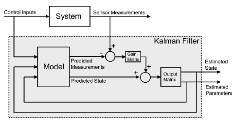

# Kalman Filtresi

## Kalman Filresi Nedir ?

Kalman filtresi, ölçülen verilerden yola çıkarak bir sistemin sonraki durumunu tahmin etmeye çalışan bir algoritmadır. Bunu, veriler gürültülü ya da hatalı olsa bile başarıyla yapabilir. Özellikle veri füzyonu ve sensör füzyonu gibi görevlerde yaygın olarak kullanılır. Yani farklı kaynaklardan gelen bilgileri bir araya getirerek daha doğru ve güvenilir sonuçlar elde etmeyi sağlar.adını 1960 yılında resmi olarak sunan Macar asıllı matematiksel sistem teorisyeni Rudolf Emil Kálmán'dan almıştır

Temelinde istatistik ve kontrol teorisi bulunan bu yöntem, sistemin kendi dinamiklerini ve ölçüm hatalarını aynı anda hesaba katar. Böylece sistemin gerçek durumuna mümkün olduğunca yakın bir kestirim yapar. Bu yaklaşım sayesinde, tek başına ölçümlerle ulaşılamayacak kadar güvenilir ve dengeli tahminler elde edilir.

## Kalman Filtresinin Temel Prensipleri ve Mekanizması

Kalman filtresi, sürekli bir döngü içerisinde çalışan iki temel adımdan oluşur. Bu adımların tekrarı, filtrenin sürekli olarak kendini güncellemesini sağlar.

### 1\. Tahmin (Prediction) Aşaması

Bu aşamada filtre, bir önceki zamandaki durum tahminini ve sistemin dinamik modelini kullanarak bir sonraki durumu öngörür. Bu adım, sistemin fiziksel yasalarını veya bilinen davranış modelini temel alır. Tahmin sürecinde, sistemin geleceği hakkında kesin bilgiye sahip olunmadığı için tahminin belirsizliği artar.

### 2\. Güncelleme (Update) Aşaması

Yeni bir ölçüm elde edildiğinde, filtre bu ölçümü kullanarak tahmin edilen durumu düzeltir. Bu süreç, belirsiz olan tahmini ve yeni gelen ölçüm verilerini dinamik olarak birleştirerek en doğru kestirimi sağlar. Her yeni ölçümle birlikte tahmin sürekli olarak güncellenir.

#### Gerçek Hayattan Örnek: GPS ile Araç Takibi

- Tahmin Adımı: Bir araç belirli bir hızda ilerliyorsa, filtre bu hız bilgisini kullanarak aracın bir sonraki konumunu tahmin eder.
    
- Güncelleme Adımı: GPS sensöründen yeni bir konum ölçümü geldiğinde, bu ölçüm filtreye girer. Filtre, kendi tahminini bu yeni ölçümle birleştirerek aracın konumu için daha doğru bir kestirim yapar.

Bu döngü, araç hareket ettiği sürece devam ederek konumu en doğru şekilde belirlemeye yardımcı olur.

### Kalman Filtrelerinde Sistem Belirsizlikleri

Kalman filtresinde, sistemdeki belirsizlikleri istatistiksel olarak temsil eden iki temel parametre bulunur. Bu parametreler, filtrenin tahminleri ile ölçümlerin nasıl birleştirileceğini belirler.

- Süreç Gürültüsü (Q): Sistemin matematiksel modelindeki hataları veya dinamiklerindeki öngörülemeyen rastgelelikleri temsil eder. Örneğin, bir roketin konumunu tahmin ederken rüzgarın etkisinin modele dahil edilememesi bu duruma yol açar.
    
- Ölçüm Gürültüsü (R): Sensörlerden gelen verilerdeki hataları veya gürültüyü temsil eder. Örneğin, bir ağırlık sensörünün aynı nesneyi tekrar tekrar tarttığında farklı sonuçlar vermesi buna bir örnektir.
    

### Kalman Kazancı (K)

Filtrenin tahmininin doğruluğunun bir ölçüsü olan Kovaryans Matrisi (P) ile birlikte, Kalman Kazancı (K) filtrede kilit bir rol oynar. K, filtrenin yeni ölçüme ne kadar güveneceğini belirleyen bir çarpandır. Bu kazanç, tahmin ile ölçüm arasındaki farkı ölçeklendirerek tahmini düzeltmek için kullanılır.

- Yüksek bir K değeri: Filtrenin kendi model tahmininden ziyade yeni gelen ölçümleri daha yakından takip etmesini sağlar.
    
- Düşük bir K değeri: Filtrenin kendi modeline daha fazla güvendiğini gösterir.
    

Kalman Kazancının değeri, Süreç Gürültüsü (Q) ve Ölçüm Gürültüsü (R) matrisleri arasındaki ilişkiyle doğrudan belirlenir.

- Eğer sistem modeli hatası yüksekse (Q yüksek) veya ölçüm hatası düşükse (R düşük), filtre kendi model tahminine olan güvenini azaltarak sensör verisine daha çok ağırlık verir. Bu durumda K değeri artar.
    
- Eğer ölçüm hatası yüksekse (R yüksek) veya sistem modeli hatası düşükse (Q düşük), filtre ölçümlerdeki gürültüden etkilenmek yerine kendi içindeki model tahminine daha fazla ağırlık verir. Bu durumda K değeri düşer.
    

Bu mekanizma, Kalman filtresinin sadece bir veri düzleştirme aracı olmadığını; veriye ve modele olan göreceli güveni sürekli olarak değerlendirerek en iyi tahmini yapan dinamik bir algoritma olduğunu kanıtlar.ünyadaki problemlerin çoğunda Q ve R değerleri kesin olarak bilinemediğinden, mühendisler bu parametreleri genellikle deneme-yanılma (trial-and-error) yöntemiyle ayarlar.

## Kalman Filresinin Matematiksel Alt Tabanı

Bir sistem genel olarak şu şekilde ifade edilir:

* **Durum Denklemi (State Equation):**

$$
x_{k} = F_{k-1} x_{k-1} + B_{k-1} u_{k-1} + w_{k-1}
$$

* **Ölçüm Denklemi (Measurement Equation):**

$$
z_{k} = H_{k} x_{k} + v_{k}
$$

Burada:

* $x_{k}$: Sistemin $k$. andaki durumu
* $F_{k-1}$: Durum geçiş matrisi
* $B_{k-1}$: Kontrol girdisinin sisteme etkisini belirten matris
* $u_{k-1}$: Kontrol girdisi
* $w_{k-1}$: Süreç gürültüsü (kovaryansı Q)
* $z_{k}$: Ölçüm vektörü
* $H_{k}$: Ölçüm matrisi
* $v_{k}$: Ölçüm gürültüsü (kovaryansı R)

Filtrenin algoritması iki ana adımdan oluşur:

1. **Tahmin (Prediction):**

$$
\hat{x}_{k|k-1} = F_{k-1} \hat{x}_{k-1|k-1} + B_{k-1} u_{k-1}
$$

$$
P_{k|k-1} = F_{k-1} P_{k-1|k-1} F_{k-1}^T + Q
$$

2. **Güncelleme (Update):**

$$
K_{k} = P_{k|k-1} H_{k}^T (H_{k} P_{k|k-1} H_{k}^T + R)^{-1}
$$

$$
\hat{x}_{k|k} = \hat{x}_{k|k-1} + K_{k}(z_{k} - H_{k} \hat{x}_{k|k-1})
$$

$$
P_{k|k} = (I - K_{k} H_{k}) P_{k|k-1}
$$

## Daha Gelişmiş Kalman Filtreleri

## Uygulama Alanları ve Sonuç

## Kaynakça

https://medium.com/@syndrome/kalman-filter-nedir-51c38a12c423

https://en.wikipedia.org/wiki/Kalman_filter

https://www.youtube.com/watch?v=HCd-leV8OkU

