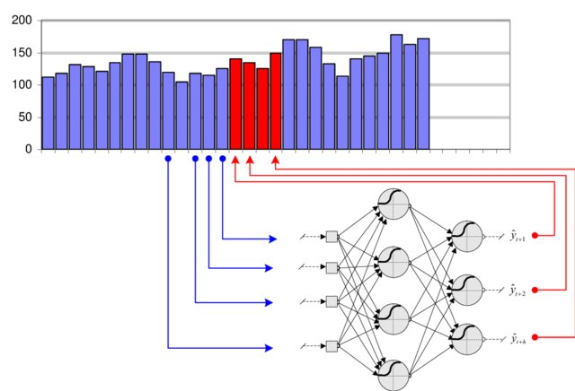

# Recurrent Neural Networks

https://www.youtube.com/watch?v=AsNTP8Kwu80&t=253s bu abi çok iyi

## Nerden çıktı bu RNN

Rnn ne olduklarını ve nasıl çalıştıklarını anlatmadan önce feed forwoed nçral netwrokların neden eksik oldugundan bahsedelim.

bir feedforward (ileri beslemeli) ağa sunduğunuzda, çıktılar birbirinden bağımsız olur:

$$
y_0 = F_\theta(x_0) \\
y_1 = F_\theta(x_1) \\
\ldots \\
y_t = F_\theta(x_t)
$$

Pek çok problem ise, geçmiş değerlerini bilerek bir zaman serisinin geleceğini tahmin etmek gibi, zaman serilerine bağlıdır.

bu probelmi çözmek için önceki verinin bir kısmı input olrak verilir

bu işelmin getirdigi  iki kritik problem bulunmaktadır :

- Problem 1: How long should the window be?
- Problem 2: Having more input dimensions increases dramatically the complexity of the classifier (VC dimension), hence the number of training examples required to avoid overfitting.

## Zaman içinde bilgi taşımak

RNN’lerin en önemli avantajı, her gizli durumun bir önceki duruma bağlı olması sayesinde **bilgiyi zaman boyunca taşıyabilmesidir**.

Bu sayede RNN’ler yalnızca mevcut input’a değil, aynı zamanda **dolaylı olarak \$h\_{t-1}\$’da kodlanmış geçmiş input’lara** da bakarak tahmin yapabilir.

Bu özellik RNN’leri şu tip problemler için çok uygun hale getirir:

* **Zaman serisi tahmini (time series forecasting)**
* **Doğal dil işleme (Natural Language Processing - NLP)**
* **Konuşma tanıma (speech recognition)**
* **Müzik üretimi (music generation)**

## Backpropagation Through Time (BPTT) ile RNN eğitimi

Normal sinir ağlarında olduğu gibi RNN’ler de **backpropagation** ile eğitilir.
Fakat burada ağırlıklar **zaman boyunca tekrar tekrar kullanıldığı** için, özel bir versiyon kullanılır:

> **Backpropagation Through Time (BPTT)**

### Nasıl çalışır?

1. **Ağı zaman boyunca aç:**
   Örneğin 5 zaman adımı için açıldığında, RNN 5 katmanlı bir feedforward ağı gibi olur.

2. **İleri geçiş (forward pass):**
   Tüm gizli durumları $h\_t$ ve çıktıları $y\_t$ hesapla.

3. **Toplam kaybı hesapla:**
   Çoğunlukla tüm zaman adımlarındaki kayıplar toplanır:

   $$
   L = \sum_{t=1}^T L_t
   $$

4. **Geri yayılım (backward pass):**
   Zincir kuralı (chain rule) ile **zaman boyunca** \$W\_x\$ ve \$W\_h\$’ye göre gradyanları hesapla. Böylece her zaman adımından gelen katkılar birikerek güncellenir.

## Uzun dönem bağımlılık problemi

Teoride RNN’ler **uzun dönem bağımlılıkları (long-range dependencies)** öğrenebilir.
Ancak pratikte şu iki sorundan dolayı zorlanırlar:

* **Vanishing gradients (kaybolan gradyanlar):**
  Gradyanlar geri doğru yayılırken üssel olarak küçülür ve uzun dönem etkiler öğrenilemez.

* **Exploding gradients (patlayan gradyanlar):**
  Gradyanlar üssel olarak büyüyerek çok büyük değerler alır, bu da eğitimi kararsız hale getirir.
  mesela degeri 2 olan bir verinin 20 tane girdigi zaman $ 2^20 $

Bu yüzden standart RNN’ler büyük verilerde genelde etkisiz kalır.

## LSTM ile çözüm
  
  Rnn bu problemeni çözmek için lstm mekanızması geliştirilmiştir.lstmler Hangi bilginin tutulacağına, hangisinin unutulacağına ve çıktıya aktarılacağına karar veren kapılar (gates) kullanır. Bu sayede uzun dönemli bilgiyi hatırlayabilir.lstm hakkında daha ayrıntılı bilgi daha sonra eklencek

## Örnekler 

pytouch kod örnegi olcak
