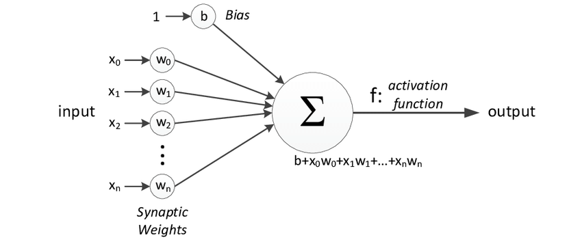
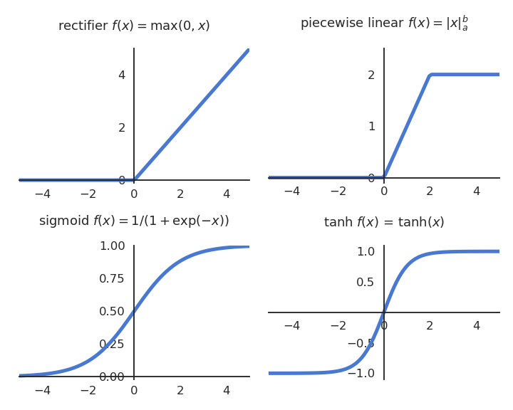

# Yapay Sinir Ağları Nedir ve Yapı taşları neleridr?
İnsan beynindeki sinir hücrelerinden esinlenerek geliştirilen yapay sinir ağları, günümüzde görüntü tanıma, doğal dil işleme ve oyun yapay zekası gibi birçok alanda kullanılmaktadır. Peki, bu sistemler nasıl öğrenir ve çalışır?hadi temel yapı taşlarını tanıyarak başlayalım.

## Nöronlar (Neurons)
Yapay sinir ağlarının temel yapı birimi olan nöronlar, bir katsayı (weight) ve bir ağırlığa (bias) sahip olan bir fonksiyona benzerler. Ancak, bir fonksiyondan farklı olarak birden fazla girdiye sahip olabilirler ve her girdi için farklı katsayılara sahip olabilirler. Ayrıca, bünyelerinde bir aktivasyon fonksiyonu bulunur. Aktivasyon fonksiyonunun ne olduğundan ileride bahsedeceğiz. Bir nöronun görselleştirilmiş matematiksel karşılığı:



## Aktivasyon Fonksiyonları

Yapay sinir ağlarında, aktivasyon fonksiyonları nöronların çıkışlarını belirleyen matematiksel fonksiyonlardır. Aktivasyon fonksiyonları, girdiyi alıp belirli bir dönüşüm uygulayarak ağırlıklı toplamın sonucunu sınırlar. En yaygın aktivasyon fonksiyonları şunlardır:

### Sigmoid Fonksiyonu
Sigmoid fonksiyonu, çıkışları $ (0,1) $ aralığında sınırlandıran doğrultulmuş bir fonksiyondur. Matematiksel ifadesi şu şekildedir:

$$
\sigma(x) = \frac{1}{1 + e^{-x}}
$$

Bu fonksiyon, özellikle lojistik regresyon ve eski sinir ağı modellerinde yaygın olarak kullanılmıştır. Ancak, türevlerinin küçük olması sebebiyle gradyan kaybolma problemi yaratabilir.

### Tanjant Hiperbolik (Tanh) Fonksiyonu
Tanh fonksiyonu, sigmoid fonksiyonuna benzerdir ancak çıktıları $ (-1,1) $ aralığındadır. Matematiksel olarak şu şekilde tanımlanır:

$$
\tanh(x) = \frac{e^x - e^{-x}}{e^x + e^{-x}}
$$

Bu fonksiyon, sıfır merkezli olması nedeniyle genellikle sigmoid fonksiyonuna göre daha avantajlıdır.

### ReLU (Rectified Linear Unit) Fonksiyonu
ReLU fonksiyonu, modern sinir ağlarında en yaygın kullanılan aktivasyon fonksiyonlarından biridir ve şu şekilde tanımlanır:

$$
f(x) =
\begin{cases} 
    x, & x > 0 \\
    0, & x \leq 0
\end{cases}
$$

kod karşılıgı:
```python
def relu(x):
    if x > 0:
        return x
    else:
        return 0
```

ReLU, gradyan kaybolma problemini büyük ölçüde azaltır ve hesaplama açısından daha verimlidir. Ancak, negatif girdilerde gradyanın sıfır olması nedeniyle "ölü nöron" problemi ortaya çıkabilir.

### Leaky ReLU Fonksiyonu
Leaky ReLU, ReLU fonksiyonunun sıfır olmayan küçük negatif bir eğim ile değiştirilmiş versiyonudur:

$$
f(x) =
\begin{cases} 
    x, & x > 0 \\
    \alpha x, & x \leq 0
\end{cases}
$$

Burada $ \alpha $ genellikle küçük bir sabit değer olarak (örneğin $ \alpha = 0.01 $) seçilir. Bu sayede, negatif girdiler için de küçük bir gradyan korunur.

### Softmax Fonksiyonu
Softmax fonksiyonu, özellikle sınıflandırma problemlerinde çıktı katmanında kullanılır. Birden fazla sınıf için olasılık dağılımı sağlar ve şu şekilde tanımlanır:

$$
\sigma(x_i) = \frac{e^{x_i}}{\sum_{j} e^{x_j}}
$$

kod karşilıgi:
```python
def softmax(x):
    exp = np.exp(x)
    seum = np.sum(exp)
    return exp / seum
```

Bu fonksiyon, girdileri normalize ederek olasılık değerlerine dönüştürür ve toplamlarını 1 yapar.



# Sinir Aglarının inşa edilmesi

İhtiyacımız olan temel bileşenlerin neler olduğunu öğrendik. Peki bu bileşenleri nasıl birleştireceğiz ve elde edeceğimiz şey neye benzeyecek? Bu soruları cevaplamak için ilk olarak layer kavramının ne olduğundan bahsetmeliyiz.

## Layerlar (katmanlar)

layerler içim üst üste gelmiş noronlar desek çokta sorun olmaz aynı alanda parelel olarak çalışan noron toplulukları denebilir kendileri için bir araya gerelerk neurol networkları oluşturular.katmanlar bulundukları yere göre üçe ayrılırlar:

1.  **Giriş Katmanı (Input Layer)**: Giriş katmanı, verilerin ham bir şekilde girdigi ilk katmandır. Bu katmandadır.buyuklugu veri setine göre değişir örnek 28 x 28 bir görsel için her piksel için bir noron atanır.
2.  **Gizli Katmanlar (Hidden Layers)**: Gizli katmanlar, modelin öğrenmesini sağlayan katmanlardır. Bu katmanlarda, nöronlar çeşitli ağırlıklar ve aktivasyon fonksiyonları kullanarak veriyi işler. Katmanlar arasında yapılan işlemler, verinin daha soyut ve anlamlı hale gelmesini sağlar. Ne kadar fazla gizli katman varsa, ağ o kadar derinleşir.
3.  **Çıktı Katmanı (Output Layer)**: Çıktı katmanı, modelin nihai tahminini yaptığı katmandır. Bu katman, ağın amacına göre değişir. Örneğin, sınıflandırma problemlerinde her bir sınıf için bir nöron bulunabilir ve bu nöronların çıktıları, modelin tahmin ettiği olasılıkları temsil eder.


## Katman Hesaplamalarına Genel Bakış
"Katmanların ne olduğunu öğrendik. Şimdi bunu bilgisayarlara anlatırken, ağırlıkları matrisler halinde tutup, gelen input ile matris çarpımı yaparak bir sonraki katmana geçecek verileri elde edebiliyoruz. Bu matris, gelen input ile nöron sayısı kadar genişliğe sahip oluyor. Biasları da aynı şekilde bir matriste tutup gerekli matris toplaması ile sonraki katmana verilmesi gereken veri elde edebiliriz.Bu matrislerin transpozları kullanrak modele ters taraftan bakılabilir.Egitim sürecinde bu bakışın sebebini ele alacagız.


## Sinir Ağı Tipleri ve kullanım alanları

Sinir ağları, farklı yapı ve mimarilerle farklı amaçlar için tasarlanabilirler. İhtiyaca göre ağın tipi değişir.Layer sayısı ve tipi önemlidir.Layer sayısı artıkça model karmaşıklarşır ve daha derin konularda çıkarımlarda bulunmaya başlar.Günümüzde model parametleri insanların anlamayacagı seviyede karmaşıklık seviyelerine ulaşmıştır.Ayrıca long time short memory gibi kavramların hayatımıza girmesi ile modeller hafıza yetenegine sahip olabilmektedir.Bu tip konulara girmeden önce temel network tiplerine bakalım 

### Feedforward neurol network (Multi-layer perceptron)

Bir tane hidden layer olan en temel yapay sinir agı biçimidir.Temel sınıflandırma ve regresyon problemlerinde yaygın olarak kullanılır.butun neuronlar önceki layer butun neuronlarına baglıdır bu da mlp full connected layer yapar.

### Recurrent Neural Network

Zaman serisi verilerini ve ardışık bilgileri işlemek için tasarlanmıştır.Doğal dil işleme, konuşma tanıma, hava tahmini gibi alanlarda kullanılır.Bellek özeleigi sayesinde daha derin konularda kullanılabilir.

### Convolutional Neural Network (CNN)

Konvolüsyonel Sinir Ağları (CNN), özellikle görüntü işleme ve bilgisayarla görme alanlarında kullanılan bir yapay sinir ağı türüdür. Girdi verisini bir dizi konvolüsyonel filtre ile işler ve öznitelik çıkarımı yapar. Görüntü sınıflandırma, obje tespiti ve segmentasyon gibi görevlerde yaygın olarak kullanılır. Katman yapısı genellikle konvolüsyonel katmanlar, havuzlama (pooling) katmanları ve tam bağlantılı katmanlardan oluşur.

### Generative Adversarial Networks

Generative Adversarial Networks, veri üretmek için kullanılan bir yapay sinir ağı modelidir. İki bileşenden oluşur: Üretici ağ (Generator) ve Ayrımcı ağ (Discriminator). Üretici ağ, gerçekçi sahte veriler üretmeye çalışırken; ayrımcı ağ, üretilen veriyi gerçek veriden ayırt etmeye çalışır. Görüntü oluşturma, veri artırma ve stil transferi gibi uygulamalarda yaygın olarak kullanılır.

### Deep Neural Network

Derin sinir ağları, birden fazla gizli katmana sahip yapılar olarak tanımlanır. Bu ağlar, yüksek veri hacimleri ve karmaşık problemlerin çözümü için uygundur. Görüntü işleme, doğal dil işleme ve konuşma tanıma gibi alanlarda derin öğrenme tekniklerinin temelini oluşturur.

### Autoencoders

Autoencoderlar, veriyi sıkıştırmak ve yeniden oluşturmak için kullanılan yapay sinir ağı modelleridir. Girdi verisini daha düşük boyutlu bir gösterime indirger ve ardından bu gösterimi tekrar orijinal boyuta dönüştürmeye çalışır. Özellikle öznitelik çıkarımı, veri gürültüsünü azaltma ve boyut indirgeme gibi uygulamalarda kullanılır.