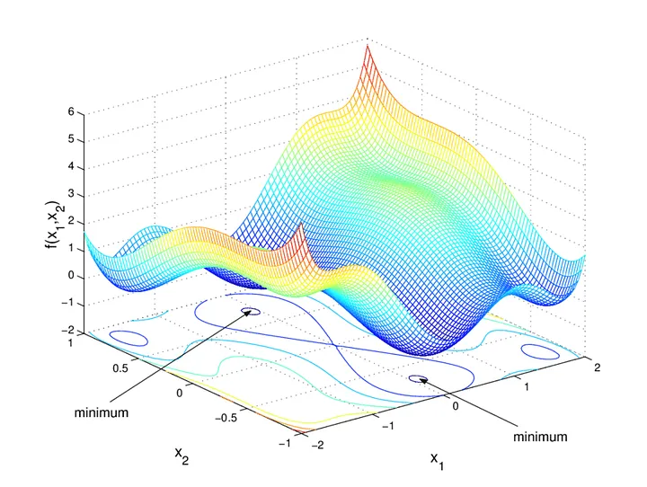

# Optimizasyon Teknikleri

## Türev Tabanlı Tekniklere Derinlemesine Bakış

### Gradient Descent

Gradient descent parametlerin maliyet fonksiyonun türevi ile güncellenmesi ile minimum bulunmasını amaçlayan optimizsasyon methodur.matematiksel tanımı Burada:

* $\theta$: parametre vektörü
* $\eta$: öğrenme oranı (learning rate)
* $\nabla_\theta f(\theta)$: gradyan vektörü


$$
\theta \leftarrow \theta - \eta \nabla_\theta f(\theta)
$$

Adım adım bur süreci anlatmamız gerekeirse:

1-) Her parametre için Kayıp Fonksiyonun (loss function) türevini al.

2-) Parametreler için rastgele değerler topla ve toplanan değerleri parametrelere gönder.

3-)Adım büyüklüğü (step size) hesapla.

4-) Yeni parametreyi hesapla.

5-) Minimum seviyeye ulaşasıya kadar 2. adıma dön.




**Steepest descent**, genellikle, öğrenme oranı $\eta$'nın her adımda negatif gradyan yönünde maksimum kazanç sağlayacak şekilde seçildiği gradient descent türü olarak tanımlanır.
Bu $\eta$'nın (adım büyüklüğünün) her iterasyonda nasıl belirleneceğini araştıran kısma **line search** denir.

---

### Steepest Descent

* **Gradient descent** yalnızca negatif gradyan yönünde bir azalma sağlar.
* **Steepest gradient descent** ise, fonksiyonun en büyük yönlü türevine göre azalma yapar.

**En dik iniş yöntemi**, bir fonksiyonun minimumunu bulmak için kullanılan iteratif bir optimizasyon algoritmasıdır. Her adımda fonksiyonun gradyanının tersi yönünde ilerleyerek minimuma doğru hareket edilir.

#### Adım Büyüklüğü ($\epsilon$)

Yeni noktaya hangi büyüklükte adım atılacağını belirler:

$$
x_{\text{yeni}} = x_{\text{eski}} - \epsilon \cdot \nabla f
$$

Burada $\epsilon$, genellikle $\frac{d}{d\epsilon} f(z(\epsilon)) = 0$ çözülerek hesaplanır.

Diyelim ki bir tepenin eteklerindeyiz ve ne kadar ilerlememiz gerektigini hesaplalmız gerekiyorTepedeki eğim sana hangi yöne gitmen gerektiğini söyler (gradient yönü).Ama ne kadar uzağa gitmen gerektiğini seçmek için, adımını büyütüp küçülttüğünde yolda ne kadar aşağı indiğine bakarsın.En çok aşağı indiğin adım uzunluğunda durursun.Matematikte bu, fonksiyonun adım uzunluğuna göre türevini alıp sıfıra eşitlemekle aynı şeydir.

#### Örnek 1: $f(x) = x^4$

* $z(\epsilon) = x - \epsilon \cdot 4x^3$
* Eğer minimum noktanın $0$ olduğu biliniyorsa:

$$
\epsilon = \frac{1}{4x^2}
$$

Yine başlangıçtan bağımsız olarak tek adımda minimuma ulaşılır.

---

#### Örnek 1: 2 boyutlu — $f(x_1,x_2)=x_1^2+3x_2^2$

- Gradyan:

$$
\nabla f = \begin{bmatrix} 2x_1 \\ 6x_2 \end{bmatrix}
$$

- Arama yönü:

$$
X_{\text{yeni}} = X - t \nabla f
= \begin{bmatrix}
x_1 - 2 t x_1 \\
x_2 - 6 t x_2
\end{bmatrix}
= \begin{bmatrix}
x_1 (1 - 2t) \\
x_2 (1 - 6t)
\end{bmatrix}
$$

$$
z(t) = \begin{bmatrix} x_1(1-2t) \\ x_2(1-6t) \end{bmatrix}
$$

- Line search sonucunda optimal $t$:


$$
t = \frac{x_1^2 + 9x_2^2}{2x_1^2 + 54x_2^2}
$$

* İterasyon:

$$
X_{n+1} = X_n - t \cdot \nabla f
$$

---

### Aradaki farkı görmek python

```python 
import numpy as np
import matplotlib.pyplot as plt

# Fonksiyon ve gradient
def f(x):
    return (x[0] - 3)**2 + (x[1] + 1)**2

def grad_f(x):
    return np.array([2*(x[0] - 3), 2*(x[1] + 1)])

# Gradient descent sabit adımla
def gradient_descent_step(x, eta):
    return x - eta * grad_f(x)

# Steepest descent line search ile
def steepest_descent_step(x):
    d = -grad_f(x)
    # line search: burada minimize edilecek fonksiyon
    phi = lambda alpha: f(x + alpha * d)
    # çok kaba bir search
    alphas = np.linspace(0, 1, 100)
    phi_values = [phi(a) for a in alphas]
    best_alpha = alphas[np.argmin(phi_values)]
    return x + best_alpha * d

# Başlangıç noktası
x0 = np.array([0.0, 0.0])

# İterasyonlar
steps = 20
eta = 0.1

gd_points = [x0]
sd_points = [x0]

x_gd = x0.copy()
x_sd = x0.copy()

for i in range(steps):
    x_gd = gradient_descent_step(x_gd, eta)
    x_sd = steepest_descent_step(x_sd)
    gd_points.append(x_gd)
    sd_points.append(x_sd)

gd_points = np.array(gd_points)
sd_points = np.array(sd_points)

# Plot
plt.figure(figsize=(8,6))
X, Y = np.meshgrid(np.linspace(-1,5,100), np.linspace(-3,2,100))
Z = (X - 3)**2 + (Y + 1)**2
plt.contour(X, Y, Z, levels=30)

plt.plot(gd_points[:,0], gd_points[:,1], 'o-', label='Gradient Descent (sabit adım)')
plt.plot(sd_points[:,0], sd_points[:,1], 's-', label='Steepest Descent (line search)')

plt.plot(3, -1, 'rx', markersize=12, label='Minimum')

plt.legend()
plt.title('Gradient Descent vs Steepest Descent')
plt.xlabel('x')
plt.ylabel('y')
plt.grid(True)
plt.show()
```

---

## Lineer Yaklaşım (Linear Approximation)

Bir fonksiyonu belirli bir noktada **doğrusal** kabul ederek, değerini yaklaşık hesaplamaya çalışır. Bu, birinci dereceden Taylor açılımına dayanır:

$$
f(x+\Delta x) \approx f(x) + \Delta x \cdot f'(x)
$$

---

### Örnek 1: $(1.0002)^{50}$

* $f(x)=x^{50}$, $x=1$, $\Delta x=0.0002$
* Yaklaşım:

$$
f(1.0002) \approx 1 + 0.0002 \cdot 50 = 1.01
$$
### Örnek 2: $f(x)=\ln x$

* $x$ 1'e yakınsa:

$$
\ln x \approx x-1
$$

* $x$ 2'ye yakınsa:

$$
\ln x \approx \ln 2 + \frac{x-2}{2}
$$

### Daha iyi yaklaşım için Taylor serisi

Daha yüksek dereceden serilerle daha doğru sonuçlar elde edilir:

$$
f(x+\Delta x) \approx \sum_{i=0}^{N} \frac{f^{(i)}(x)}{i!} (\Delta x)^i
$$

## Newton-Raphson Metodu

Bir fonksiyonun köklerini ($f(x)=0$) veya ekstremumlarını ($f'(x)=0$) bulmak için kullanılan iteratif bir yöntemdir.


### 1. Dereceden (Kök Bulma)

$$
x_{n+1} = x_n - \frac{f(x_n)}{f'(x_n)}
$$

* **Örnek:** $\sqrt{2}$ bulmak için $x^2-2=0$

$$
x_{n+1} = x_n - \frac{x_n^2 -2}{2x_n}
$$

$x_0=1$ ile başlayınca birkaç adımda $\approx 1.41421$.

### 2. Dereceden (Minimum/Maksimum Bulma)

$$
x_{n+1} = x_n - \frac{f'(x_n)}{f''(x_n)}
$$


### Karşılaştırma

| Özellik        | Gradient Descent        | Newton-Raphson      |
| -------------- | ----------------------- | ------------------- |
| Adım Büyüklüğü | Belirlenir ($\epsilon$) | Yok (otomatik)      |
| Hesaplama      | Daha az türev           | Daha fazla türev    |
| Yakınsama      | Genelde yavaş           | Genelde hızlı       |
| Risk           | Daha stabil             | Döngü (cycle) riski |

Örneğin, $f(x)=x^3-2x+2$ için yanlış başlangıç noktaları yöntemin döngüye girmesine yol açabilir.

Tabii! İşte o yazının sonuna, adım adım çalışma açıklamasını eklenmiş hali:

---

## Levenberg-Marquardt (LM) algoritması

Levenberg-Marquardt algoritması, doğrusal olmayan problemlerin karesal hata formülleri ile optimizasyonu için kullanılır.

Gradient descent ile Gauss-Newton yönteminin bir kombinasyonu gibidir.

### ⚙ Algoritmanın Çekirdeği

Her iterasyonda $x$ için şu lineer sistem çözülür:

$$
\bigl( J^T J + \lambda I \bigr) \delta = - J^T r
$$

* $J = \frac{\partial r}{\partial x}$: Jacobian matrisi ($m \times n$)
* $\lambda > 0$: damping parametresi
* $I$: birim matris

Yeni parametre:

$$
x_{\text{new}} = x + \delta
$$

### ⚖ Gauss-Newton & Gradient Descent Köprüsü

* Küçük $\lambda$ → **Gauss-Newton gibi davranır** (hızlı, ama kararsız olabilir).
* Büyük $\lambda$ → **gradient descent gibi davranır** (daha yavaş, ama daha güvenli).

### 🔄 Adaptif $\lambda$

* Eğer adım **başarılı** (yani hata azalıyor) ise $\lambda$ **küçültülür** → Gauss-Newton’a yaklaşır.
* Eğer adım **başarısız** (hata artıyor) ise $\lambda$ **büyütülür** → gradient descent’e yaklaşır.

---

### 🚀 Algoritmanın Adım Adım İşleyişi

1. **Başlangıç**

   * Başlangıç parametresi $x_0$ ve damping katsayısı $\lambda_0$ seçilir.
   * Bir büyütme oranı $\nu > 1$ (ör. 10) belirlenir.

2. **Her iterasyonda:**

   * **Residual vektörü ve Jacobian hesaplanır:**

     $$
     r(x) = \begin{bmatrix} r_1(x) \\ \vdots \\ r_m(x) \end{bmatrix}, 
     \quad 
     J = \frac{\partial r}{\partial x}
     $$
   * **Lineer sistem çözülür:**

     $$
     \bigl(J^T J + \lambda I\bigr) \delta = - J^T r
     $$
   * **Yeni parametre adayı hesaplanır:**

     $$
     x_{\text{new}} = x + \delta
     $$

3. **Hata kontrol edilir:**

   * Yeni hata $E(x_{\text{new}}) = \frac12 \|r(x_{\text{new}})\|^2$ hesaplanır.
   * Eğer $E(x_{\text{new}}) < E(x)$:

     * $x$ güncellenir: $x \leftarrow x_{\text{new}}$
     * $\lambda$ azaltılır: $\lambda \leftarrow \lambda / \nu$
   * Aksi halde:

     * Adım reddedilir (eski $x$ korunur)
     * $\lambda$ artırılır: $\lambda \leftarrow \lambda \cdot \nu$

4. **Yakınsama kontrol edilir:**

   * $\|\delta\|$ çok küçükse veya hata yeterince azalmışsa algoritma durur.


```python
import numpy as np
from scipy.optimize import least_squares

# Model fonksiyonu
def model(x, t):
    return x[0] * np.exp(-x[1] * t) + x[2]

# Residual (hata) fonksiyonu
def residuals(x, t, y):
    return y - model(x, t)

# Örnek veri
t_data = np.linspace(0, 5, 50)
y_data = 2 * np.exp(-1.3 * t_data) + 0.5 + 0.1*np.random.randn(len(t_data))

# Başlangıç tahmini
x0 = [1, 1, 1]

# LM optimizasyon
result = least_squares(residuals, x0, args=(t_data, y_data), method='lm')

print("Bulunan parametreler:", result.x)
```

bu video çok iyi :
https://www.youtube.com/watch?v=UQsOyMj9lnI&t=19s

## BFGS

Çok gelişmiş bir optimzasyon algoritması öptimizasyon kütüphanelerindeki min() funk arkasında çalışan genel algoritmadır kendisi .Bir quasi-Newton yöntemi olarak geçer. quasi newron yönteminin nasıl çalıştıgından bahsedelim ilk:

- Newton yöntemindeki gibi H^-1 ∇f(x) (H = Hessian) kullanmak isteriz.

- Ama Hessian matrisini (∇²f) doğrudan hesaplamak maliyetli ve bazen mümkün değil.

- Bunun yerine iterasyonlarda Hessian (ya da onun tersi) için yaklaşık bir matris B veya H tutulur ve her adımda güncellenir.

bfgs algoritması bunu belli bir prensipte gerçekleştiri bunun nasıl çalıştıhını anlamak için adım adım inceleleyelim

### 🔍 BFGS algoritmasının adımları

Kısaca:

1. Başlangıç tahmini:

   * `x_0` (başlangıç noktası)
   * `H_0 = I` (ters Hessian yaklaşık matrisi genelde birim matris ile başlatılır).

2. Her iterasyonda:

   * Gradient hesaplanır: `g_k = ∇f(x_k)`
   * Adım yönü hesaplanır:

     ```
     p_k = - H_k * g_k
     ```
   * Uygun adım büyüklüğü (line search) ile `α_k` bulunur.
   * Yeni nokta:

     ```
     x_{k+1} = x_k + α_k * p_k
     ```
   * Gradient farkı:

     ```
     y_k = ∇f(x_{k+1}) - ∇f(x_k)
     ```
   * Nokta farkı:

     ```
     s_k = x_{k+1} - x_k
     ```
   * `H_k` güncellenir:

     ```
     ρ_k = 1 / (y_kᵗ s_k)
     V_k = (I - ρ_k s_k y_kᵗ)
     H_{k+1} = V_k H_k V_kᵗ + ρ_k s_k s_kᵗ
     ```

     (Bu formul **BFGS update formülü** olarak bilinir.)

3. Kriter sağlanmazsa (`||∇f||` küçük değilse) bir sonraki iterasyona geçilir.


## Kaynakça

- https://www.youtube.com/watch?v=QGFct_3HMzk
- https://www.mit.edu/~hlb/StantonGrant/Lecture9/quadratic.pdf
- https://www.youtube.com/watch?v=VIoWzHlz7k8
- https://www.youtube.com/watch?v=UQsOyMj9lnI&t=19s
- [Medium — Steepest Descent](https://medium.com/@habicoban/steepest-descent-algoritmas%C4%B1-fonksiyon-optimizasyonunda-bir-ad%C4%B1m-%C3%B6ne-ge%C3%A7mek-aac7bc58d4d0)
- https://medium.com/data-science/linear-regression-using-gradient-descent-97a6c8700931

