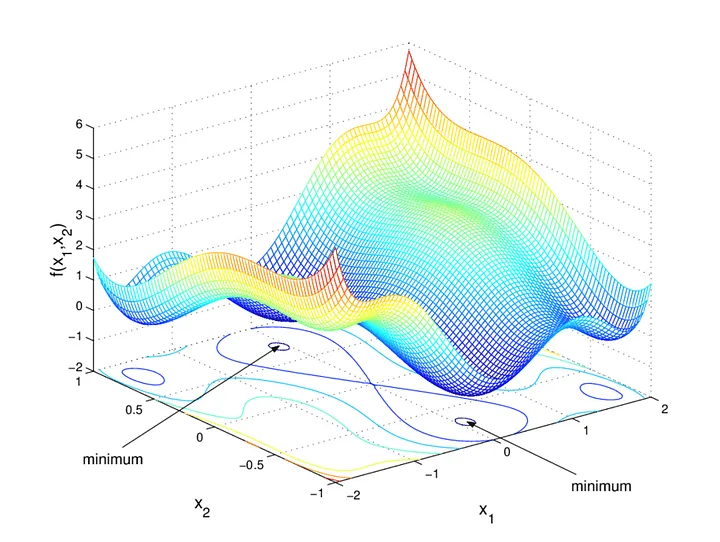

# Optimizasyon Teknikleri

## Türev Tabanlı Tekniklere Derinlemesine Bakış

### Gradient Descent

Gradient descent parametlerin maliyet fonksiyonun türevi ile güncellenmesi ile minimum bulunmasını amaçlayan optimizsasyon methodur.matematiksel tanımı Burada:

* $\theta$: parametre vektörü
* $\eta$: öğrenme oranı (learning rate)
* $\nabla_\theta f(\theta)$: gradyan vektörü

$$
\theta \leftarrow \theta - \eta \nabla_\theta f(\theta)
$$

Adım adım bur süreci anlatmamız gerekeirse:

1-) Her parametre için Kayıp Fonksiyonun (loss function) türevini al.

2-) Parametreler için rastgele değerler topla ve toplanan değerleri parametrelere gönder.

3-)Adım büyüklüğü (step size) hesapla.

4-) Yeni parametreyi hesapla.

5-) Minimum seviyeye ulaşasıya kadar 2. adıma dön.

**Steepest descent**, genellikle, öğrenme oranı $\eta$'nın her adımda negatif gradyan yönünde maksimum kazanç sağlayacak şekilde seçildiği gradient descent türü olarak tanımlanır.
Bu $\eta$'nın (adım büyüklüğünün) her iterasyonda nasıl belirleneceğini araştıran kısma **line search** denir.

---

### Steepest Descent

* **Gradient descent** yalnızca negatif gradyan yönünde bir azalma sağlar.
* **Steepest gradient descent** ise, fonksiyonun en büyük yönlü türevine göre azalma yapar.

**En dik iniş yöntemi**, bir fonksiyonun minimumunu bulmak için kullanılan iteratif bir optimizasyon algoritmasıdır. Her adımda fonksiyonun gradyanının tersi yönünde ilerleyerek minimuma doğru hareket edilir.

#### Adım Büyüklüğü ($\epsilon$)

Yeni noktaya hangi büyüklükte adım atılacağını belirler:

$$
x_{\text{yeni}} = x_{\text{eski}} - \epsilon \cdot \nabla f
$$

Burada $\epsilon$, genellikle $\frac{d}{d\epsilon} f(z(\epsilon)) = 0$ çözülerek hesaplanır.

---

#### Örnek 1: $f(x) = x^4$

* $z(\epsilon) = x - \epsilon \cdot 4x^3$
* Eğer minimum noktanın $0$ olduğu biliniyorsa:

$$
\epsilon = \frac{1}{4x^2}
$$

Yine başlangıçtan bağımsız olarak tek adımda minimuma ulaşılır.

---

#### Örnek 2: 2 boyutlu — $f(x_1,x_2)=x_1^2+3x_2^2$

* Gradyan:

$$
\nabla f = \begin{bmatrix} 2x_1 \\ 6x_2 \end{bmatrix}
$$

* Arama yönü:

$$
z(t) = \begin{bmatrix} x_1(1-2t) \\ x_2(1-6t) \end{bmatrix}
$$

* Line search sonucunda optimal $t$:

$$
t = \frac{x_1^2 + 9x_2^2}{2x_1^2 + 54x_2^2}
$$

* İterasyon:

$$
X_{n+1} = X_n - t \cdot \nabla f
$$

---

#### Arama Yönünün Dikeyliği

En dik iniş yönteminde, her yeni arama yönü bir önceki yöne dik olur. Bu algoritmanın ilerleyişini karakterize eden önemli bir özelliktir.

---

## Lineer Yaklaşım (Linear Approximation)

Bir fonksiyonu belirli bir noktada **doğrusal** kabul ederek, değerini yaklaşık hesaplamaya çalışır. Bu, birinci dereceden Taylor açılımına dayanır:

$$
f(x+\Delta x) \approx f(x) + \Delta x \cdot f'(x)
$$

---

### Örnek 1: $(1.0002)^{50}$

* $f(x)=x^{50}$, $x=1$, $\Delta x=0.0002$
* Yaklaşım:

$$
f(1.0002) \approx 1 + 0.0002 \cdot 50 = 1.01
$$

---

### Örnek 2: $f(x)=\ln x$

* $x$ 1'e yakınsa:

$$
\ln x \approx x-1
$$

* $x$ 2'ye yakınsa:

$$
\ln x \approx \ln 2 + \frac{x-2}{2}
$$

---

### Daha iyi yaklaşım için Taylor serisi

Daha yüksek dereceden serilerle daha doğru sonuçlar elde edilir:

$$
f(x+\Delta x) \approx \sum_{i=0}^{N} \frac{f^{(i)}(x)}{i!} (\Delta x)^i
$$

## Newton-Raphson Metodu

Bir fonksiyonun köklerini ($f(x)=0$) veya ekstremumlarını ($f'(x)=0$) bulmak için kullanılan iteratif bir yöntemdir.

---

### 1. Dereceden (Kök Bulma)

$$
x_{n+1} = x_n - \frac{f(x_n)}{f'(x_n)}
$$

* **Örnek:** $\sqrt{2}$ bulmak için $x^2-2=0$

$$
x_{n+1} = x_n - \frac{x_n^2 -2}{2x_n}
$$

$x_0=1$ ile başlayınca birkaç adımda $\approx 1.41421$.

---

### 2. Dereceden (Minimum/Maksimum Bulma)

$$
x_{n+1} = x_n - \frac{f'(x_n)}{f''(x_n)}
$$

---

### Karşılaştırma

| Özellik        | Gradient Descent        | Newton-Raphson      |
| -------------- | ----------------------- | ------------------- |
| Adım Büyüklüğü | Belirlenir ($\epsilon$) | Yok (otomatik)      |
| Hesaplama      | Daha az türev           | Daha fazla türev    |
| Yakınsama      | Genelde yavaş           | Genelde hızlı       |
| Risk           | Daha stabil             | Döngü (cycle) riski |

Örneğin, $f(x)=x^3-2x+2$ için yanlış başlangıç noktaları yöntemin döngüye girmesine yol açabilir.

---

## Kaynakça

- Mfa hocamızın notları
- [Medium — Steepest Descent](https://medium.com/@habicoban/steepest-descent-algoritmas%C4%B1-fonksiyon-optimizasyonunda-bir-ad%C4%B1m-%C3%B6ne-ge%C3%A7mek-aac7bc58d4d0)
- https://medium.com/data-science/linear-regression-using-gradient-descent-97a6c8700931

